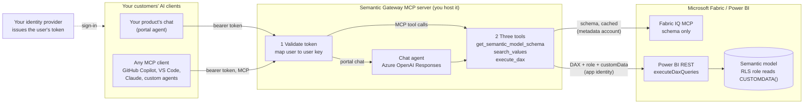
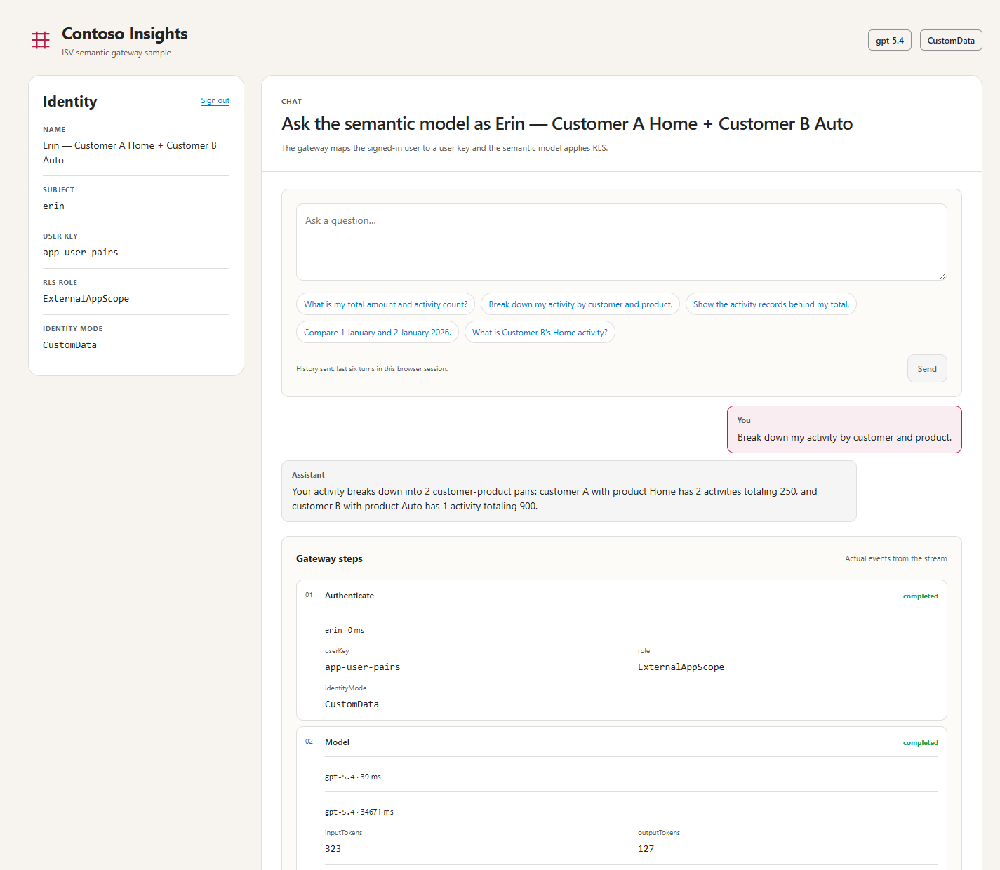
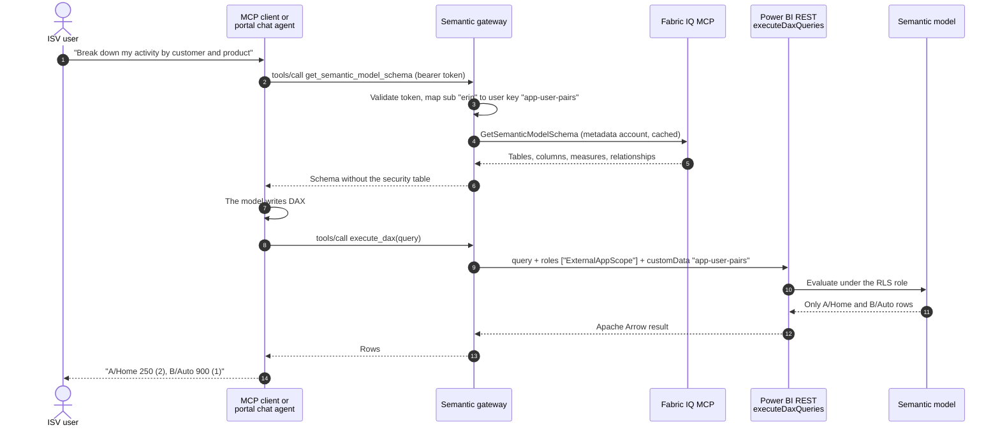
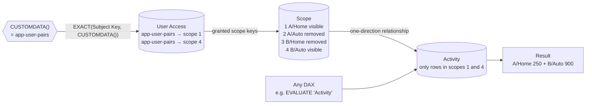

# Semantic Gateway MCP server: AI analytics for ISV users on Power BI semantic models

**A custom MCP server the ISV hosts in front of Microsoft Fabric: your users sign in to your app, any MCP
client can ask questions, and the semantic model's row-level security decides what each user sees.**

> **Educational sample.** This is a clear, working reference for a pattern, not a Microsoft product or
> a production-ready service. It uses synthetic data only. Everything described below ran live on
> 29 September 2026; see [what ran live](#what-ran-live).

## The problem

Independent software vendors (ISVs) often embed Power BI in their product with **app owns data**: the
product signs users in with its own identity provider, and a backend service principal tells Power BI
which rows each user may see. Those users are **not** Microsoft Entra users.

Now the ISV's customers want AI over the same data, and increasingly they want to use **the MCP client
they already have** (GitHub Copilot, VS Code, Claude or their own agent) rather than only a chat box
inside the product. Two things block the obvious route:

1. The [Fabric IQ MCP server](https://learn.microsoft.com/fabric/iq/connectors/fabric-iq-mcp) runs every
   tool, including `ExecuteQuery`, **as the signed-in Entra user**. ISV end users have no Entra identity,
   and there is no parameter that says *"run this as application user A1"*.
2. Handing customers a direct connection to Fabric would mean handing out Entra identities and bypassing
   the product's own sign-in, entitlements and audit.

## The solution in one picture

The ISV runs a **Semantic Gateway MCP server**: a custom MCP server next to its product, and the only
thing any AI client talks to. It is an MCP server to your clients, an MCP client to Fabric IQ (schema only),
and the point where every query gets the user's key. Full architecture, how to add it to your app and the
user auth flow: [docs/architecture.md](docs/architecture.md).



Three rules make it safe:

> **Your identity provider decides who is asking. The gateway attaches that user's key to every query.
> The semantic model decides which rows exist for them.**

The model (or the MCP client) writes the DAX, but it never chooses the user, the role, the key or the
credentials. Row-level security runs inside the engine after the query is written, so even an
unfiltered or adversarial query only returns the caller's rows.



## Contents

- [Architecture, app integration and auth flow](docs/architecture.md)
- [How a question flows](#how-a-question-flows)
- [The three tools](#the-three-tools)
- [How the semantic model enforces access](#how-the-semantic-model-enforces-access)
- [Identities](#identities)
- [Customer-selected MCP clients](#customer-selected-mcp-clients)
- [Relationship to Power BI Embedded](#relationship-to-power-bi-embedded)
- [What ran live](#what-ran-live)
- [Security responsibilities](#security-responsibilities)
- [Run it yourself](#run-it-yourself)
- [Repository map](#repository-map)
- [FAQ](#faq)

## How a question flows

The same flow serves both front doors. An MCP client runs the tool loop itself; the portal's chat agent
runs it inside the gateway with Azure OpenAI, and starts with the cached schema already in hand, which
saves one model round trip.



What each Microsoft call carries:

| Call | Endpoint | Identity | Carries |
|---|---|---|---|
| Read schema | Fabric IQ MCP `https://fabriciq.svc.cloud.microsoft/v1/mcp/fabriciq`, tool `GetSemanticModelSchema`, through the official [MCP C# SDK](https://github.com/modelcontextprotocol/csharp-sdk) client | Delegated **metadata account**, signed in once | The model ID |
| Run DAX | `POST https://api.powerbi.com/v1.0/myorg/groups/{workspace}/datasets/{model}/executeDaxQueries` ([docs](https://learn.microsoft.com/rest/api/power-bi/datasets/execute-dax-queries-in-group)) | **App identity**: service principal with a certificate | DAX, `roles`, `customData` |
| Portal chat | `POST https://<resource>.openai.azure.com/openai/v1/responses` with function tools and `store: false` | Gateway's Azure identity (managed identity in Azure, Azure CLI locally) | Question, tool definitions, tool results |
| Embedded report (optional) | `GenerateToken` ([docs](https://learn.microsoft.com/rest/api/power-bi/embed-token/generate-token)) | The same app identity | The same role and key |

## The three tools

They are defined once in
[SemanticModelTools.cs](src/SemanticGateway/Tools/SemanticModelTools.cs) and offered to both the MCP
endpoint and the portal agent.

| Tool | Arguments | What the gateway does |
|---|---|---|
| `get_semantic_model_schema` | none | Returns the Fabric IQ schema from a cache (re-read in the background every 60 minutes by default; a snapshot on disk covers IQ outages). Tables listed in `FabricIq:ExcludeTables`, such as the RLS mapping table, are removed. Schema is the same for every user, because RLS filters rows, not metadata. |
| `search_values` | `table`, `column`, `search_text` | Finds exact text values (for example *Home*) **among the rows this user may see**, so a user cannot even discover values outside their scope. Replaces IQ `ValueSearch`. |
| `execute_dax` | `query` | Runs the DAX through `executeDaxQueries` with the fixed role and the caller's key. Replaces IQ `ExecuteQuery`. A small check rejects identity functions (`CUSTOMDATA()`, `USERNAME()`), `INFO` functions, DMVs and excluded tables; it is defense in depth, not the boundary. |

No tool accepts a user, role, key or model ID as an argument. The user always comes from the validated
token. In the live run, an extra `userKey` argument injected into `execute_dax` was ignored.

For agents connecting over MCP, the bundled
[semantic-gateway skill](.github/skills/semantic-gateway/SKILL.md) is a simplified FabricIQ workflow
adapted to these three tools: schema, scoped value lookup, DAX and a grounded answer. It does not
call native IQ data-query tools or supply identity arguments.
[Using the skill with an MCP client](docs/mcp-clients.md#companion-analytics-skill).

## How the semantic model enforces access

The gateway sends `roles: ["ExternalAppScope"]` and `customData: "<user key>"` with every query. The
role reads `CUSTOMDATA()` and filters inside the engine:



The role, as deployed from
[ExternalAppScope.tmdl](model/Synthetic.SemanticModel/definition/roles/ExternalAppScope.tmdl):

```dax
// Table permission on 'Scope': keep only the pairs granted to CUSTOMDATA()
VAR _subject = CUSTOMDATA()
VAR _scope = 'Scope'[Scope Key]
RETURN
    NOT ISBLANK(_subject) && _subject <> ""
        && COUNTROWS(FILTER('User Access',
               EXACT('User Access'[Subject Key], _subject) && 'User Access'[Scope Key] == _scope)) > 0

// Table permission on 'User Access': a user cannot list anyone else's grants
VAR _subject = CUSTOMDATA()
RETURN NOT ISBLANK(_subject) && _subject <> "" && EXACT('User Access'[Subject Key], _subject)
```

A missing, empty or unknown key matches nothing. `ALL()` and `REMOVEFILTERS()` cannot widen access:
RLS restricts the tables themselves, and those functions only remove filters from the query.

## Identities

| Identity | Who or what | Authenticates with | Used for |
|---|---|---|---|
| **ISV user** | Your customer's user, e.g. `erin`. Not in Entra. | Your identity provider. The demo has a built-in development issuer. | Signing in to the portal or an MCP client. The gateway maps them to a user key, e.g. `app-user-pairs`. |
| **App identity** | An Entra service principal owned by the ISV | Certificate (client credentials) | Every data query and embed token, for every user, like app-owns-data Embedded. **Workspace Admin**, because only Admins may choose `roles` on `executeDaxQueries`. |
| **Metadata account** | One delegated Entra account | A public client app. One interactive `sign-in`, then silent refresh from the OS-protected MSAL cache. | Reading the schema from Fabric IQ, and nothing else. IQ `ExecuteQuery` is never called. |
| **Gateway's Azure identity** | Managed identity in Azure, your Azure CLI sign-in locally | `ManagedIdentityCredential` on App Service or Container Apps, otherwise `AzureCliCredential` for the tenant; the token is cached | The portal agent's Azure OpenAI calls (*Cognitive Services OpenAI User*). |

Only tokens issued **for the gateway** (issuer and audience validated) are accepted. The gateway never
forwards a user's token to Microsoft services, and never accepts a Microsoft token from a client.

## Customer-selected MCP clients

The `/mcp` endpoint is a standard MCP server built with the official
[MCP C# SDK](https://github.com/modelcontextprotocol/csharp-sdk) (Streamable HTTP, stateless). It follows
the [MCP authorization specification](https://modelcontextprotocol.io/specification/2026-07-28/basic/authorization):

- Unauthenticated calls get `401` with `WWW-Authenticate: Bearer resource_metadata="…"`.
- `/.well-known/oauth-protected-resource` (RFC 9728) names the authorization server your clients use.
- Tokens must be issued for the gateway. No token passthrough.
- Tools are annotated read-only.

In the live run, **GitHub Copilot CLI** connected as an unmodified MCP client, listed the three tools,
read the schema, recovered from its own DAX error, and returned only the signed-in user's rows. Setup for
Copilot CLI, VS Code and other clients: [docs/mcp-clients.md](docs/mcp-clients.md).

For production, point `Auth:Authority` at an identity provider that supports the MCP OAuth flow
(authorization code with PKCE, plus client ID metadata documents or dynamic client registration), so
MCP clients can sign users in interactively. The demo uses a pre-issued development token instead.

## Relationship to Power BI Embedded

This is the **app owns data** idea applied to AI queries. If you already embed Power BI this way, most
of your design carries over.

| Aspect | Power BI Embedded, app owns data | This gateway | Relationship |
|---|---|---|---|
| Who signs the user in | Your app, any identity provider | Your app, any identity provider | **Same** |
| Who calls Power BI | Service principal | The same service principal | **Same** (needs workspace Admin for `roles`) |
| Who decides access | Your backend | Your backend | **Same** |
| How the user reaches RLS | `GenerateToken` effective identity: `username`, `roles`, `customData` | Every `executeDaxQueries` call: `roles`, `customData` | **Same idea, different carrier** |
| Where RLS runs | A semantic-model role | The same role | **Same**, if the role reads `CUSTOMDATA()` |
| Browser token | Embed token | None; the browser only holds your app's token | **Not used** |
| Query author | Report visuals, designed in advance | An LLM, per question | **Differs** |
| Semantic context | Not needed | Fabric IQ schema, through a metadata account | **New** |

Measured, not assumed:

- **Parity.** For the same user, the embedded report's exported rows matched the gateway's rows
  (`Match`), with the same role and key in both paths.
- **`USERNAME()` roles do not transfer.** An embed token with `username` set to an opaque app key filtered
  correctly through a `USERNAME()` role. `executeDaxQueries` with the same value as `effectiveUsername`
  was rejected, because it expects a real directory identity. Use a `CUSTOMDATA()` role for both paths.

Details, including how to migrate an existing Embedded role: [docs/power-bi-embedded.md](docs/power-bi-embedded.md).

## What ran live

29 September 2026, synthetic model on a Fabric F8 capacity, GPT-5.4 on Azure OpenAI. Full record:
[docs/evidence/live-validation-2026-09-29.md](docs/evidence/live-validation-2026-09-29.md).

| User (user key) | Grants | `execute_dax` of the same unfiltered query |
|---|---|---|
| alice (`app-user-A1`) | A/Home | 250 across 2 activities |
| bob (`app-user-A2`) | A/Auto | 100 across 2 |
| carol (`app-user-A3`) | A/Home, A/Auto | 350 across 4 |
| dan (`app-user-B1`) | B/Home | 700 across 1 |
| erin (`app-user-pairs`) | A/Home, B/Auto | 1,150 across 3 |
| frank (`app-user-none`) | none | no rows |

Also observed:

- **Portal agent.** 6 to 10 s per question, measured right after a restart (carol 6.1 s, dan 8.0 s, erin's
  two-pair breakdown 9.7 s with 2 model calls). A background warmer keeps the schema and the Power BI and
  Azure OpenAI tokens fresh. An "ignore the filters" request took 16.4 s and still returned only dan's row.
  Before caching and warming, 25 to 92 s.
- **Out-of-scope question.** Dan asked about Customer A. The RLS-scoped value search found nothing, and the agent said so.
- **GitHub Copilot CLI.** It returned Carol's two rows only.
- **Embedded parity.** `Match`.
- **Fabric IQ schema.** 3.4 s on first read, cached afterwards.

## Security responsibilities

What the pattern gives you:

- **The AI cannot widen access.** Role and key come from the gateway, and RLS runs in the engine.
- **Unknown or unentitled users get nothing.** They are rejected at the gateway or see empty results.
- **Errors fail closed.** Service errors reach the client as tool errors, never as partial data.

What you own:

- **One app identity carries every user's queries.** `executeDaxQueries` allows 120 query requests per
  minute per caller, and all ISV users share the app identity. Cache, queue or shard for real traffic.
- **The app identity is powerful.** As workspace Admin without a role it could read everything, so the
  gateway always sends the role. Keep its certificate in Key Vault or use a managed identity.
- **The metadata account's delegated scopes allow more than schema reads.** Keep IQ `ExecuteQuery` and
  `ValueSearch` out of reach, and give the account the least access that still reads the schema. The
  model's `MetadataOnly` role is there to deny it rows (not verified in this sample).
- **Correct is not the same as secure.** RLS keeps answers inside the user's scope; it does not make
  generated DAX right. Show the rows, and evaluate answer quality separately.
- **Schema and data are untrusted input to the LLM.** Descriptions, AI instructions and values can carry
  prompt injection. The model still cannot change who is asking.

## Run it yourself

You need a Fabric capacity, a workspace, rights to create two app registrations, and an Azure OpenAI
deployment. The numbered setup, with scripts, is in [scripts/README.md](scripts/README.md). In short:

```powershell
pwsh .\scripts\Deploy-SemanticModel.ps1 -TenantId <tenant> -WorkspaceId <workspace>
pwsh .\scripts\New-AppIdentity.ps1 -TenantId <tenant>
pwsh .\scripts\Add-WorkspaceMember.ps1 -TenantId <tenant> -WorkspaceId <workspace> -PrincipalId <sp-object-id> -PrincipalType ServicePrincipal -Role Admin
pwsh .\scripts\New-MetadataClient.ps1 -TenantId <tenant>
# fill src\SemanticGateway\appsettings.Local.json, then:
npm --prefix .\src\web install; npm --prefix .\src\web run build
dotnet run --project .\src\SemanticGateway -- sign-in
dotnet run --project .\src\SemanticGateway      # http://localhost:5187
```

Prerequisites: .NET 8 SDK, Node.js 24+, PowerShell 7, Azure CLI.

## Repository map

| Path | What is there |
|---|---|
| [src/SemanticGateway/](src/SemanticGateway/) | **The Semantic Gateway MCP server.** ASP.NET Core: token validation, MCP server, portal chat agent, Fabric IQ schema client, `executeDaxQueries` client, embed tokens. Start with [Program.cs](src/SemanticGateway/Program.cs). |
| [src/web/](src/web/) | The sample ISV portal (React): sign-in, chat with a live tool timeline, embedded report and parity check. |
| [model/](model/) | Synthetic TMDL semantic model with the RLS roles, and a one-visual PBIR report for the Embedded comparison. |
| [scripts/](scripts/) | Setup: deploy the model and report, create the app identity and metadata client, grant workspace access, Azure OpenAI Bicep. |
| [samples/](samples/) | Synthetic users and MCP client configuration examples. |
| [.github/skills/semantic-gateway/](.github/skills/semantic-gateway/) | Companion agent skill: a simplified FabricIQ query workflow using only the gateway's three tools. |
| [docs/](docs/) | [Architecture, app integration and auth flow](docs/architecture.md), MCP client guide, Power BI Embedded comparison, live evidence. |
| [dev/](dev/) | Verification used while building: a 42-check live RLS harness, unit tests and a TMDL validator. Not needed to run the sample. |

## FAQ

**Why not call Fabric IQ's `ExecuteQuery` with the metadata account?** It would run as that account, not
as your user, so RLS would apply to the wrong identity, or not at all if the account is a workspace
Admin, Member or Contributor.

**Why not give MCP clients Fabric IQ directly?** Your users are not Entra users, and your product's
sign-in, entitlements and audit would be bypassed.

**Why use Fabric IQ at all?** It is the AI-facing description of the model: tables, measures,
relationships and model-authored AI instructions, maintained with the model. The execution side does not
depend on it; the schema could come from elsewhere.

**Why not let the LLM filter by customer?** Then the LLM becomes the security boundary. Here the engine
filters after the LLM is done.

**Can an embed token call these APIs?** No. Embed tokens authorize embedded content only.

**Do users need Power BI licenses or Entra accounts?** They do not need Entra accounts. Review capacity
and licensing for your own topology.

## License

Code and documentation are licensed under [MIT](LICENSE). Microsoft product names and artwork keep their
own terms; see [THIRD_PARTY_NOTICES](THIRD_PARTY_NOTICES). This sample is not endorsed by Microsoft. To
report a security issue, see [SECURITY.md](SECURITY.md).
