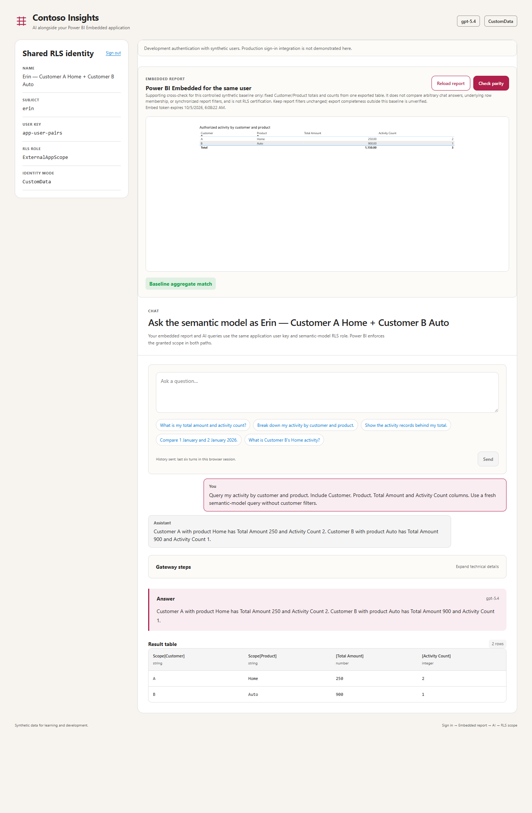
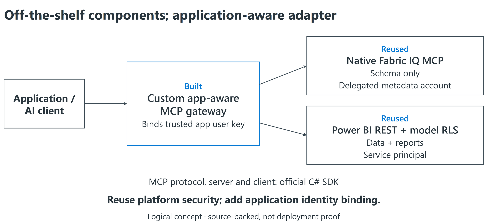
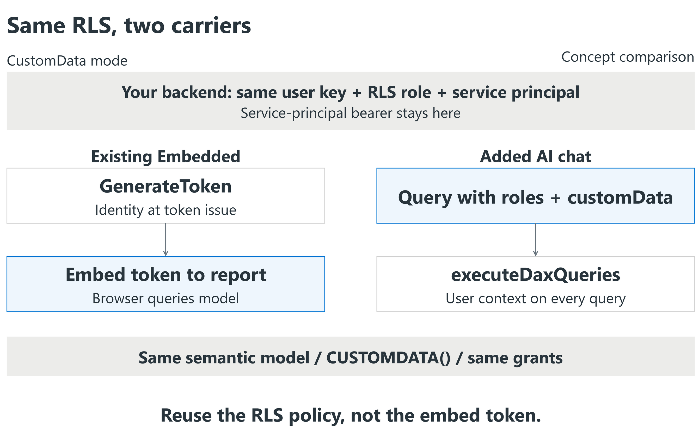
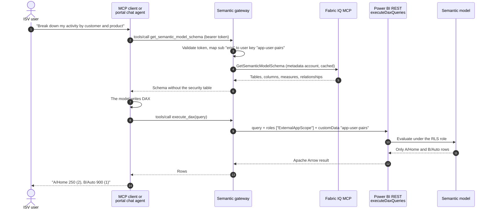
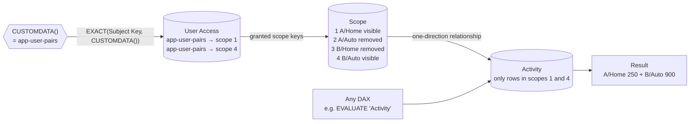

# Add AI chat to Power BI Embedded with model-enforced RLS

**Reuse your application's identity and entitlement mapping so Embedded reports and AI-generated DAX
are evaluated under the same semantic-model row-level security (RLS) role.**

This repository implements an ISV-hosted **Semantic Gateway**: application chat and MCP clients call
the gateway, which binds each query to the authenticated user's application key. Power BI enforces
the model's RLS; the language model does not decide authorization. The validated path uses
`CUSTOMDATA()`, not an embed token passed to an AI service.

> **Educational reference, not a production service or Microsoft product.** Live validation on
> 5 October 2026 demonstrated the same-user Embedded/AI path with synthetic data. The
> [dated evidence](docs/evidence/live-validation-2026-10-05.md) distinguishes tested behavior from
> production identity, hosting, and customer-model integrations that remain unqualified.

## Start with the Embedded experience

The sample portal presents the report and shared RLS identity before chat. Sign in as a synthetic user,
load their report, and ask for a customer/product breakdown. Changing the user changes the scope in
both paths without changing the query's authorization rules.

| Persona | Grants | Observed in the report and fresh AI queries |
|---|---|---|
| `erin` | A/Home and B/Auto | 250 across 2 activities + 900 across 1; total 1,150 across 3. |
| `dan` | B/Home only | 700 across 1. A direct Customer A query using `ALL('Scope')` still returned no rows. |
| `frank` | None | Valid empty results, not another user's data or a failed request disguised as zero. |

<details>
<summary>See the live same-user report and AI proof</summary>



</details>

The report comparison is a **baseline aggregate cross-check**, not certification of every AI answer or
identical underlying rows. The live tests also queried the engine without customer filters to check
that the grants, rather than the AI's choice of filters, limited the results.

## The problem

Independent software vendors (ISVs) often embed Power BI in their product with **app owns data**: the
product signs users in with its own identity provider, and a backend service principal tells Power BI
which rows each user may see. The scenario here does not require those users to have identities or
permissions in the Fabric tenant; they may use the ISV's existing identity provider.

Now the ISV's customers want AI over the same data, and increasingly they want to use **the MCP client
they already have** (GitHub Copilot, VS Code, Claude or their own agent) rather than only a chat box
inside the product. Direct Fabric access is not a drop-in replacement for that application-owned
identity model:

1. The [Fabric IQ MCP server](https://learn.microsoft.com/fabric/iq/connectors/fabric-iq-mcp) runs every
   tool, including `ExecuteQuery`, **as the signed-in Entra user**. That delegated identity does not
   automatically carry the ISV's opaque application user key and grants.
2. Direct delegated access requires its own identity and permission integration. This sample instead
   retains the application's sign-in, entitlement lookup, and gateway boundary.

## Understand the solution in three steps

### 1. Reuse the platform; add an application-aware gateway

We do **not** modify Fabric IQ MCP or implement a new MCP protocol. The official MCP C# SDK provides
the server/client transport. We implement the application-user mapping and three tool handlers.



| Tool the AI sees in our custom gateway | What it calls underneath |
|---|---|
| `get_semantic_model_schema` | **Native Fabric IQ MCP** `GetSemanticModelSchema`, using a delegated metadata account; cached. |
| `search_values` | **Power BI REST** `executeDaxQueries`, using the app's service principal and the user's RLS context. |
| `execute_dax` | The **same Power BI query client and RLS context** used by `search_values`. |

Native IQ `ExecuteQuery` and `ValueSearch` are **not** used in this path. They run as a delegated
Fabric user, not as the ISV's opaque application-user key. The service principal does not sign in
to IQ MCP.

### 2. Reuse the RLS policy, not the embed token



**Embedded:** the backend supplies the user key and role when generating the report's embed token.

**AI:** the backend supplies the same user key and role with every generated DAX query.

Both use the same configured model role. `customData` carries the key; `CUSTOMDATA()` reads it inside
that role. The service principal's OAuth bearer stays on the backend. The report's embed token is
**not** an AI-query credential.

### 3. Share the identity and security code; change the delivery path

| Reused in this sample | Embedded report | AI query |
|---|---|---|
| [User mapping](src/SemanticGateway/Identity/AppUsers.cs) | Authenticated subject → application user key. | Same mapping. |
| [Power BI app identity](src/SemanticGateway/Fabric/PowerBiAppIdentity.cs) | Certificate-backed service principal. | Same credential component. |
| [Model role and grants](model/Synthetic.SemanticModel/definition/roles/ExternalAppScope.tmdl) | `CUSTOMDATA()` enforces authorized scopes. | Same role and grants; no LLM-owned security filter. |
| Request construction | [`GenerateToken` effective identity](src/SemanticGateway/Fabric/EmbedTokenService.cs). | [`executeDaxQueries` body](src/SemanticGateway/Fabric/DaxQueryClient.cs). This is the delivery difference. |

This is the demonstrated `CUSTOMDATA()` route. An existing opaque-username `USERNAME()` role may need
adaptation, and role-bearing service-principal queries require workspace Admin access.

[Follow one user through the calls and actual payloads](docs/embedded-ai-walkthrough.md) ·
[Editable concept diagrams and sources](docs/diagrams/README.md) ·
[Detailed architecture](docs/images/shared-rls-architecture.png)

The security division remains:

> **Your identity provider decides who is asking. The gateway attaches that user's key to every query.
> The semantic model decides which rows they may query.**

The model (or the MCP client) writes the DAX, but it never chooses the user, the role, the key or the
credentials. Executed queries are constrained by the configured model role, rather than by
LLM-authored customer filters. Correct role definitions and trusted identity mapping remain essential;
RLS does not make an unsupported or fabricated answer correct.

## Contents

- [Architecture, app integration and auth flow](docs/architecture.md)
- [Start with the Embedded experience](#start-with-the-embedded-experience)
- [Understand the solution in three steps](#understand-the-solution-in-three-steps)
- [One user, two calls: code and security walkthrough](docs/embedded-ai-walkthrough.md)
- [How a question flows](#how-a-question-flows)
- [The three tools](#the-three-tools)
- [How the semantic model enforces access](#how-the-semantic-model-enforces-access)
- [Identities](#identities)
- [Customer-selected MCP clients](#customer-selected-mcp-clients)
- [Relationship to Power BI Embedded](#relationship-to-power-bi-embedded)
- [What ran live](#what-ran-live)
- [Security responsibilities](#security-responsibilities)
- [Run it yourself](#run-it-yourself)
- [Evidence gaps and production boundaries](#evidence-gaps-and-production-boundaries)
- [Repository map](#repository-map)
- [FAQ](#faq)

## How a question flows

The same flow serves both front doors. An MCP client runs the tool loop itself; the portal's chat agent
runs it inside the gateway with Azure OpenAI, and starts with the cached schema already in hand, which
saves one model round trip.



What each Microsoft call carries:

| Call | Endpoint | Identity | Carries |
|---|---|---|---|
| Read schema | Fabric IQ MCP `https://fabriciq.svc.cloud.microsoft/v1/mcp/fabriciq`, tool `GetSemanticModelSchema`, through the official [MCP C# SDK](https://github.com/modelcontextprotocol/csharp-sdk) client | Delegated **metadata account**, signed in once | The model ID |
| Run DAX | `POST https://api.powerbi.com/v1.0/myorg/groups/{workspace}/datasets/{model}/executeDaxQueries` ([docs](https://learn.microsoft.com/rest/api/power-bi/datasets/execute-dax-queries-in-group)) | **App identity**: service principal with a certificate | DAX, `roles`, `customData` |
| Portal chat | `POST https://<resource>.openai.azure.com/openai/v1/responses` with function tools and `store: false` | Gateway's Azure identity (managed identity in Azure, Azure CLI locally) | Question, tool definitions, tool results |
| Embedded report (optional) | `GenerateToken` ([docs](https://learn.microsoft.com/rest/api/power-bi/embed-token/generate-token)) | The same app identity | The same role and key |

## The three tools

They are defined once in
[SemanticModelTools.cs](src/SemanticGateway/Tools/SemanticModelTools.cs) and offered to both the MCP
endpoint and the portal agent.

| Tool | Arguments | What the gateway does |
|---|---|---|
| `get_semantic_model_schema` | none | Returns cached Fabric IQ metadata from a delegated account. Configured tables and relationships are excluded. This is an intentionally shared metadata surface, not a per-user OLS projection; snapshot fallback may serve stale metadata. |
| `search_values` | `table`, `column`, `search_text` | Searches values through the same RLS-bound query path. Results and fallback samples reflect what the model role permits; a limited sample is not proof that an entity does not exist. Replaces IQ `ValueSearch`. |
| `execute_dax` | `query` | Runs the DAX through `executeDaxQueries` with the fixed role and the caller's key. Replaces IQ `ExecuteQuery`. A small check rejects identity functions (`CUSTOMDATA()`, `USERNAME()`), `INFO` functions, DMVs and excluded tables; it is defense in depth, not the boundary. |

No tool accepts a user, role, key or model ID as an argument. The user always comes from the validated
token. In the live run, an extra `userKey` argument injected into `execute_dax` was ignored.

For agents connecting over MCP, the bundled
[semantic-gateway skill](.github/skills/semantic-gateway/SKILL.md) is a simplified FabricIQ workflow
adapted to these three tools: schema, scoped value lookup, DAX and a grounded answer. It does not
call native IQ data-query tools or supply identity arguments.
[Using the skill with an MCP client](docs/mcp-clients.md#companion-analytics-skill).

## How the semantic model enforces access

The gateway sends `roles: ["ExternalAppScope"]` and `customData: "<user key>"` with every query. The
role reads `CUSTOMDATA()` and filters inside the engine:



The role, as deployed from
[ExternalAppScope.tmdl](model/Synthetic.SemanticModel/definition/roles/ExternalAppScope.tmdl):

```dax
// Table permission on 'Scope': keep only the pairs granted to CUSTOMDATA()
VAR _subject = CUSTOMDATA()
VAR _scope = 'Scope'[Scope Key]
RETURN
    NOT ISBLANK(_subject) && _subject <> ""
        && COUNTROWS(FILTER('User Access',
               EXACT('User Access'[Subject Key], _subject) && 'User Access'[Scope Key] == _scope)) > 0

// Table permission on 'User Access': a user cannot list anyone else's grants
VAR _subject = CUSTOMDATA()
RETURN NOT ISBLANK(_subject) && _subject <> "" && EXACT('User Access'[Subject Key], _subject)
```

A missing, empty or unknown key matches nothing. `ALL()` and `REMOVEFILTERS()` cannot widen access:
RLS restricts the tables themselves, and those functions only remove filters from the query.

## Identities

| Identity | Who or what | Authenticates with | Used for |
|---|---|---|---|
| **ISV user** | Your customer's user, e.g. `erin`. Not in Entra. | Your identity provider. The demo has a built-in development issuer. | Signing in to the portal or an MCP client. The gateway maps them to a user key, e.g. `app-user-pairs`. |
| **App identity** | An Entra service principal owned by the ISV | Certificate (client credentials) | Every data query and embed token, for every user, like app-owns-data Embedded. **Workspace Admin**, because only Admins may choose `roles` on `executeDaxQueries`. |
| **Metadata account** | One delegated Entra account | A public client app. One interactive `sign-in`, then silent refresh from the OS-protected MSAL cache. | Reading the schema from Fabric IQ, and nothing else. IQ `ExecuteQuery` is never called. |
| **Gateway's Azure identity** | Managed identity in Azure, your Azure CLI sign-in locally | `ManagedIdentityCredential` on App Service or Container Apps, otherwise `AzureCliCredential` for the tenant; the token is cached | The portal agent's Azure OpenAI calls (*Cognitive Services OpenAI User*). |

Only application tokens issued **for the gateway** (issuer and audience validated) are accepted.
An application may use Entra as its identity provider, but tokens for Power BI, Fabric, or Graph are
not gateway credentials. The gateway does not forward the user's application token to data services.

## Customer-selected MCP clients

The `/mcp` endpoint is a standard MCP server built with the official
[MCP C# SDK](https://github.com/modelcontextprotocol/csharp-sdk) (Streamable HTTP, stateless). It follows
the [MCP authorization specification](https://modelcontextprotocol.io/specification/2026-07-28/basic/authorization):

- Unauthenticated calls get `401` with `WWW-Authenticate: Bearer resource_metadata="…"`.
- `/.well-known/oauth-protected-resource` (RFC 9728) names the authorization server your clients use.
- Tokens must be issued for the gateway. No token passthrough.
- Tools are annotated read-only.

In the September live run, **GitHub Copilot CLI** connected as an unmodified MCP client, listed the three tools,
read the schema, recovered from its own DAX error, and returned only the signed-in user's rows. Setup for
Copilot CLI, VS Code and other clients: [docs/mcp-clients.md](docs/mcp-clients.md).

For production, point `Auth:Authority` at an identity provider that supports the MCP OAuth flow
(authorization code with PKCE, plus client ID metadata documents or dynamic client registration), so
MCP clients can sign users in interactively. That production flow is an integration target, not a tested
feature of the supplied portal. The demonstrated external client uses a pre-issued development token.

## Relationship to Power BI Embedded

This is the **app owns data** idea applied to AI queries. The
[two-carrier comparison](#2-reuse-the-rls-policy-not-the-embed-token) shows what stays the same.
The [code walkthrough](docs/embedded-ai-walkthrough.md) shows the identity fields side by side.

Measured, not assumed:

- **Same-user baseline agreement.** October's report exports and gateway aggregates agreed for Erin,
  Dan, and Frank, including valid empty data. Both backend paths supplied the same role and application
  key. This does not compare arbitrary chat prose or synchronize report filters.
- **Opaque usernames need qualification.** September's embed token with an opaque `username` worked
  with a `USERNAME()` role, while the corresponding `effectiveUsername` query was rejected. Do not
  assume those identity carriers are interchangeable; `CUSTOMDATA()` is the validated sample path.

The sample targets one configured workspace/model. Keep an existing application's workspace/profile
isolation; this repository does not implement multi-model routing or prove query-profile/SSO
compatibility.

Details, including how to migrate an existing Embedded role: [docs/power-bi-embedded.md](docs/power-bi-embedded.md).

## What ran live

**5 October 2026:** same-user Embedded exports, fresh AI queries, and unfiltered engine scope checks
passed for Erin, Dan, and Frank on the synthetic model. Production-path parser and analytical-table
tests, parity/component tests, TypeScript, and builds also passed. See the
[October evidence and limitations](docs/evidence/live-validation-2026-10-05.md).

**29 September 2026:** synthetic model on a Fabric F8 capacity, GPT-5.4 on Azure OpenAI. Full record:
[docs/evidence/live-validation-2026-09-29.md](docs/evidence/live-validation-2026-09-29.md).

| User (user key) | Grants | `execute_dax` of the same unfiltered query |
|---|---|---|
| alice (`app-user-A1`) | A/Home | 250 across 2 activities |
| bob (`app-user-A2`) | A/Auto | 100 across 2 |
| carol (`app-user-A3`) | A/Home, A/Auto | 350 across 4 |
| dan (`app-user-B1`) | B/Home | 700 across 1 |
| erin (`app-user-pairs`) | A/Home, B/Auto | 1,150 across 3 |
| frank (`app-user-none`) | none | no rows |

Also observed:

- **Portal agent.** 6 to 10 s per question, measured right after a restart (carol 6.1 s, dan 8.0 s, erin's
  two-pair breakdown 9.7 s with 2 model calls). Background warming attempts schema and token refresh;
  it is not an availability or latency guarantee. An "ignore the filters" request took 16.4 s and still returned only dan's row.
  Before caching and warming, 25 to 92 s.
- **Out-of-scope question.** Dan asked about Customer A. The RLS-scoped value search found nothing, and the agent said so.
- **GitHub Copilot CLI.** It returned Carol's two rows only.
- **Embedded parity.** `Match`.
- **Fabric IQ schema.** 3.4 s on first read, cached afterwards.

## Security responsibilities

What the pattern gives you:

- **Executed queries cannot choose a wider grant.** Role and key come from the trusted gateway,
  and correctly configured RLS runs in the engine. AI prose remains a separate correctness concern.
- **Unknown or unentitled users get nothing.** They are rejected at the gateway or see empty results.
- **Failures are not successful evidence.** Error rowsets and multiple data results are rejected.
  A failed replacement analytical query clears the displayed table; lookup tables do not replace it.

What you own:

- **One app identity carries every user's queries.** `executeDaxQueries` allows 120 query requests per
  minute per caller, and all ISV users share the app identity. Cache, queue or shard for real traffic.
- **The app identity is powerful.** As workspace Admin without a role it could read everything, so the
  gateway always sends the role. Protect and rotate its certificate. The supplied Power BI client
  uses a Windows certificate store or PEM pair; alternative credential integrations are not supplied.
- **The metadata account's delegated scopes allow more than schema reads.** Keep IQ `ExecuteQuery` and
  `ValueSearch` out of reach, and give the account the least access that still reads the schema. The
  model's `MetadataOnly` role is there to deny it rows (not verified in this sample).
- **Correct is not the same as secure.** RLS keeps answers inside the user's scope; it does not make
  generated DAX right. Show the rows, and evaluate answer quality separately.
- **Schema and data are untrusted input to the LLM.** Descriptions, AI instructions and values can carry
  prompt injection. Approve the shared external metadata surface, and do not equate table exclusions
  with per-user OLS or complete removal of sensitive metadata references.

## Run it yourself

Choose the onboarding track:

| Track | Starting point | Guide |
|---|---|---|
| Extend an existing Embedded app | Reuse its model, application identity, entitlement lookup, and isolation; qualify the RLS identity carrier. | [Embedded integration](docs/power-bi-embedded.md) and [architecture](docs/architecture.md). |
| Reproduce the synthetic demonstration | Create only approved demo resources and use the supplied model/personas/report. | [Numbered setup and scripts](scripts/README.md). |

Do not pass a customer model ID to the synthetic deployment script: its update path replaces the
definition with this repository's model. Obtain approval for resource creation, permissions, and
capacity costs, and record which demo resources must be removed afterward.

After configuring the gateway for either track:

```powershell
# Put your configuration in ignored src\SemanticGateway\appsettings.Local.json.
npm --prefix .\src\web ci
npm --prefix .\src\web run build
dotnet run --project .\src\SemanticGateway -- sign-in
dotnet run --project .\src\SemanticGateway      # http://localhost:5187
```

Prerequisites: .NET 8 SDK/runtime (the repository also permits newer stable SDKs), Node.js 24.15+ in
the 24.x line or Node.js 26+, PowerShell 7, and Azure CLI. The certificate-creation helper is Windows
specific. The validated deployment used F8; it is not a universal minimum sizing recommendation.

The portal agent needs an Azure OpenAI deployment and gateway access to it. External MCP clients
bring their own model. Keep tokens, certificates, real user mappings, and local operating notes out of
Git. The development issuer is only for synthetic local demonstrations, not public production sign-in.

When presenting, ensure capacity is active, sign in after the final gateway restart, and load a fresh
report token. The sample requests a ten-minute embed token; use the reload control for a longer demo.

## Evidence gaps and production boundaries

This is a proven instructional pattern, not a drop-in production package:

- The supplied portal uses a development issuer; changing `Auth:Mode` does not implement production
  browser sign-in. Real OIDC and interactive MCP OAuth require integration and qualification.
- Single-model RLS is demonstrated. Customer-specific models, profiles, SSO, composite models, and
  report-filter context are not qualified by the synthetic test.
- Metadata is shared and read under a delegated account. Least-privilege access, OLS requirements,
  snapshot provenance, and approved external schema content need review for each deployment.
- Engine authorization is distinct from answer grounding. Client-supplied history and final answer
  provenance are not fully enforced by the sample.
- Hosting, throughput, operational readiness, credential rotation, and automated teardown are operator
  responsibilities. Historical timings are observations, not an SLA.

## Repository map

| Path | What is there |
|---|---|
| [src/SemanticGateway/](src/SemanticGateway/) | **The Semantic Gateway MCP server.** ASP.NET Core: token validation, MCP server, portal chat agent, Fabric IQ schema client, `executeDaxQueries` client, embed tokens. Start with [Program.cs](src/SemanticGateway/Program.cs). |
| [src/web/](src/web/) | The sample ISV portal (React): sign-in, chat with a live tool timeline, embedded report and parity check. |
| [model/](model/) | Synthetic TMDL semantic model with the RLS roles, and a one-visual PBIR report for the Embedded comparison. |
| [scripts/](scripts/) | Setup: deploy the model and report, create the app identity and metadata client, grant workspace access, Azure OpenAI Bicep. |
| [samples/](samples/) | Synthetic users and MCP client configuration examples. |
| [.github/skills/semantic-gateway/](.github/skills/semantic-gateway/) | Companion agent skill: a simplified FabricIQ query workflow using only the gateway's three tools. |
| [docs/](docs/) | [Architecture, app integration and auth flow](docs/architecture.md), MCP client guide, Power BI Embedded comparison, live evidence. |
| [dev/](dev/) | Verification used while building: a 42-check live RLS harness, unit tests and a TMDL validator. Not needed to run the sample. |

## FAQ

**Why not call Fabric IQ's `ExecuteQuery` with the metadata account?** It would run as that account, not
as your user, so RLS would apply to the wrong identity, or not at all if the account is a workspace
Admin, Member or Contributor.

**Why not give MCP clients Fabric IQ directly?** Delegated Fabric permissions do not automatically carry
your application's opaque user key and entitlement policy. That is a different identity integration.

**Is this a native Fabric Data Agent?** No. It is a custom gateway over a Power BI semantic model.
Native data-agent service-principal support is a separate integration and does not establish this
sample's per-request external application-key RLS behavior.

**Why use Fabric IQ at all?** It is the AI-facing description of the model: tables, measures,
relationships and model-authored AI instructions, maintained with the model. The execution side does not
depend on it; the schema could come from elsewhere.

**Why not let the LLM filter by customer?** Then the LLM becomes the security boundary. Here the engine
filters after the LLM is done.

**Can an embed token call these APIs?** No. Embed tokens authorize embedded content only.

**Do users need Power BI licenses or Fabric-tenant identities?** This app-owns-data pattern does not
require provisioning the external user in the Fabric tenant. Your application still authenticates
them. Review capacity, licensing, and identity requirements for your actual topology.

## License

Code and documentation are licensed under [MIT](LICENSE). Microsoft product names and artwork keep their
own terms; see [THIRD_PARTY_NOTICES](THIRD_PARTY_NOTICES). This sample is not endorsed by Microsoft. To
report a security issue, see [SECURITY.md](SECURITY.md).
