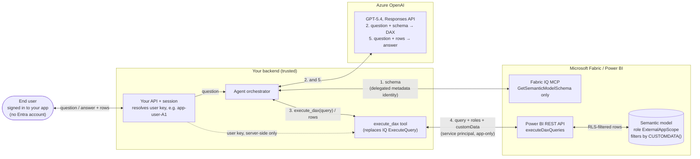
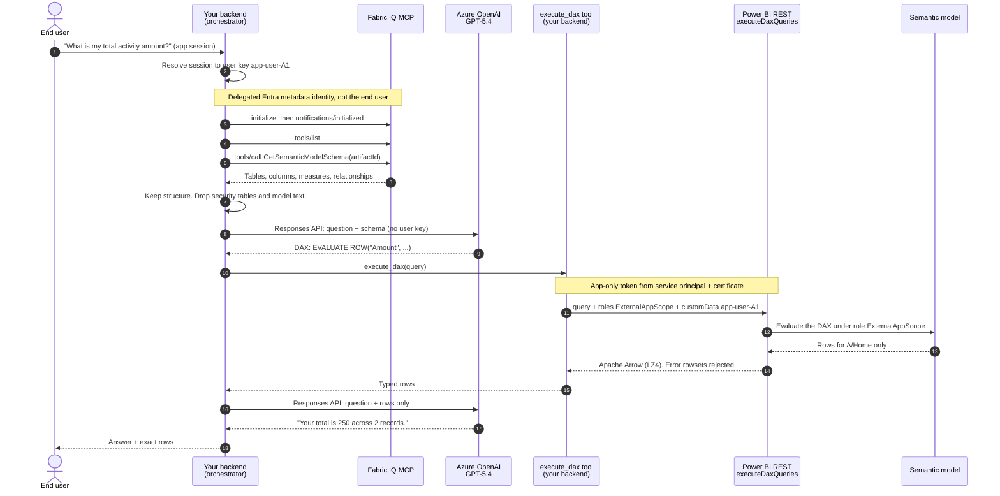
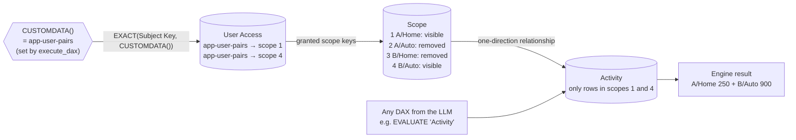
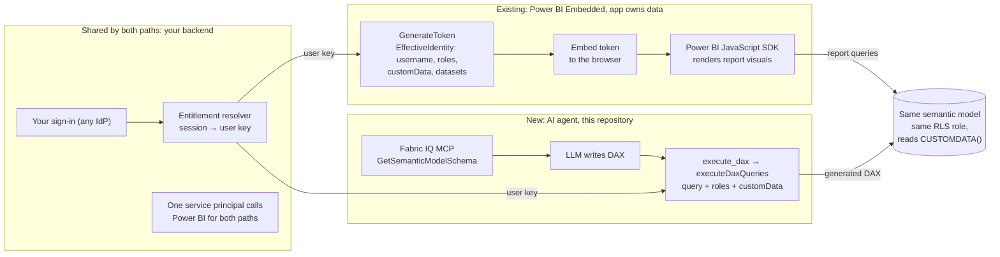

# App-owns-data AI analytics on Power BI semantic models

**Fabric IQ MCP for semantic context · a custom `execute_dax` tool for execution · semantic-model row-level security (RLS) for enforcement**

> **Educational sample.** The pattern below ran live on **28 September 2026** against a small synthetic
> model. It is not a Microsoft product, a supported feature or a production-ready application.

## In one minute

Independent software vendors (ISVs) often already embed Power BI in their product using
**app owns data**: the application signs users in with its own identity provider, and a backend
service principal tells Power BI which rows each user may see. Those users are **not** Microsoft
Entra users.

Now the ISV wants an AI agent that answers questions such as *"What is my total activity?"* over the
**same semantic model with the same RLS**. The obvious tool,
[Fabric IQ MCP](https://learn.microsoft.com/fabric/iq/connectors/fabric-iq-mcp), is delegated-only:
every tool, including `ExecuteQuery`, runs as the signed-in Entra user. There is no way to tell it
*"run this query as application user A1"*.

This repository demonstrates a pattern that closes that gap:

1. **Your application authenticates the user** and resolves a server-side **user key**, exactly as it
   does for Power BI Embedded.
2. **Fabric IQ MCP is used only for semantic context** (`GetSemanticModelSchema`). Its data tools,
   `ExecuteQuery` and `ValueSearch`, are never called.
3. **An LLM writes the DAX.** It receives the question and the schema, never credentials, roles or the
   user key.
4. **A custom `execute_dax` tool replaces IQ's `ExecuteQuery`.** It runs the DAX through the Power BI
   [`executeDaxQueries`](https://learn.microsoft.com/rest/api/power-bi/datasets/execute-dax-queries-in-group)
   REST API as the application's **service principal**, adding a fixed RLS role and the user key as
   `customData`.
5. **The semantic model enforces access.** Its RLS role reads `CUSTOMDATA()` and filters rows inside
   the engine, so even an unfiltered or adversarial query returns only that user's rows.

> **The LLM writes the query. Your backend decides who is asking. The semantic model decides which
> rows they can see.**

## Contents

- [Solution architecture](#solution-architecture)
- [How one question flows, call by call](#how-one-question-flows-call-by-call)
- [Components, precisely](#components-precisely)
- [The execute_dax tool contract](#the-execute_dax-tool-contract)
- [How the semantic model enforces access](#how-the-semantic-model-enforces-access)
- [Identities and credentials](#identities-and-credentials)
- [Relationship to Power BI Embedded (app owns data)](#relationship-to-power-bi-embedded-app-owns-data)
- [Security properties and responsibilities](#security-properties-and-responsibilities)
- [What ran live](#what-ran-live)
- [What this repository implements, and what production adds](#what-this-repository-implements-and-what-production-adds)
- [FAQ](#faq)
- [Get started](#get-started)
- [Repository map](#repository-map)
- [License](#license)

## Solution architecture



How to read it:

- Everything that decides **who is asking** lives in *your backend*: the session, the user key and the
  `execute_dax` tool that attaches them to every query.
- The LLM receives a **question and schema** (to write DAX), then the **question and the rows the engine
  already filtered** (to write the answer). It never receives the user key, the role, credentials or
  workspace and model IDs.
- Two different Entra identities call Microsoft services for the backend: a **delegated metadata
  identity** for Fabric IQ MCP, and an **app-only service principal** for query execution. Neither is
  the end user.

## How one question flows, call by call



What each service call carries:

| Call | Endpoint | Credential | Carries |
|---|---|---|---|
| Read schema | `POST https://fabriciq.svc.cloud.microsoft/v1/mcp/fabriciq` with header `X-Variants: Fabric.Routing.FabricIQ.V1`: `initialize`, `notifications/initialized`, `tools/list`, `tools/call GetSemanticModelSchema` | Delegated Entra user, scopes `Item.Read.All`, `Item.Execute.All`, `Dataset.Read.All` | The model ID only |
| Generate DAX | `POST https://<resource>.openai.azure.com/openai/v1/responses` with structured output `{"query": string}` and `store: false` | Entra token for `https://ai.azure.com/.default` | Question + projected schema |
| Execute | `POST https://api.powerbi.com/v1.0/myorg/groups/{workspaceId}/datasets/{datasetId}/executeDaxQueries` | App-only token (service principal + certificate) for `https://analysis.windows.net/powerbi/api/.default` | DAX + `roles` + `customData` |
| Explain | Responses API again, as a fresh stateless call | Same as generation | Question + authorized rows only |

The usual path is **seven service requests**: four MCP messages, one generation, one query and one
explanation.

## Components, precisely

| Component | What it is | Runs as | In this repository |
|---|---|---|---|
| Sign-in and session | Your application's existing authentication, with any identity provider | End user, through your IdP | **Not implemented.** A demo page lets a presenter pick one of six synthetic users. It stands in for sign-in and is not part of the pattern. |
| Entitlement resolver | Server code that maps an authenticated session to an opaque, immutable user key | Your backend | `SyntheticSubjects.Resolve` creates an immutable `ServerContext` ([ServerContext.cs](src/IqRls.Core/ServerContext.cs)) |
| Agent orchestrator | Server code that calls the tools and the model in order | Your backend | `DemoRunner` and `LiveDemoPlanner` run a fixed tool sequence per question, not autonomous tool selection ([DemoRunner.cs](src/IqRls.Demo/DemoRunner.cs), [LiveDemoPlanner.cs](src/IqRls.Demo/LiveDemoPlanner.cs)) |
| Fabric IQ MCP | Microsoft-hosted, generally available MCP server for Power BI semantic models. Used **only** for `GetSemanticModelSchema`. It does not write DAX. | Delegated Entra metadata identity | `FabricIqSchemaClient` allows one tool; `ReviewedSyntheticSchema` keeps tables, columns, measures and relationships and drops security tables and model-authored text ([FabricIqSchemaClient.cs](src/IqRls.Demo/FabricIqSchemaClient.cs), [ReviewedSyntheticSchema.cs](src/IqRls.Demo/ReviewedSyntheticSchema.cs)) |
| DAX generator | Azure OpenAI GPT-5.4 through the Responses API, with structured output | Entra identity with the *Cognitive Services OpenAI User* role | `ResponsesDaxGenerator` and `GeneratedDaxPolicy`, a narrow allowlist written for this synthetic model ([ResponsesDaxGenerator.cs](src/IqRls.Demo/ResponsesDaxGenerator.cs)) |
| `execute_dax` tool | The `ExecuteQuery` replacement. Its only input is `{"query": "..."}`; the server binds the user context. | Service principal with a certificate | `DaxTool` → `QueryBroker` → `ArrowResponseParser` ([ServerContext.cs](src/IqRls.Core/ServerContext.cs), [QueryBroker.cs](src/IqRls.Core/QueryBroker.cs), [ArrowResponseParser.cs](src/IqRls.Core/ArrowResponseParser.cs)) |
| Semantic model with RLS | Power BI semantic model whose role `ExternalAppScope` filters by `CUSTOMDATA()` | Power BI engine | [model/Synthetic.SemanticModel](model/Synthetic.SemanticModel): TMDL, Import mode, inline synthetic data |
| Answer composer | A second, stateless Responses API call that explains only the returned rows | Same inference identity | `ResponsesExplainer` ([CloudClients.cs](src/IqRls.Demo/CloudClients.cs)) |

Our earlier slides called steps 1–2 the "live query planner". It is not a product: it is your backend
calling **Fabric IQ MCP for schema** and then **Azure OpenAI for DAX**.

## The execute_dax tool contract

The tool's complete input schema. This is all an LLM or agent framework can supply:

```json
{
  "type": "object",
  "properties": { "query": { "type": "string", "minLength": 1, "maxLength": 32768 } },
  "required": ["query"],
  "additionalProperties": false
}
```

What the tool actually sent in the live `app-user-A1` run:

```http
POST https://api.powerbi.com/v1.0/myorg/groups/{workspaceId}/datasets/{datasetId}/executeDaxQueries
Authorization: Bearer <app-only token: service principal + certificate>
Accept: application/vnd.apache.arrow.stream
Content-Type: application/json

{
  "query": "EVALUATE ROW(\"Amount\", COALESCE([Total Amount], 0), \"Records\", COALESCE([Activity Count], 0))",
  "roles": ["ExternalAppScope"],
  "customData": "app-user-A1",
  "queryTimeout": 30,
  "resultSetRowCountLimit": 1000
}
```

| Field | Set by | Why |
|---|---|---|
| `query` | The LLM | The only LLM-controlled value. Treated as untrusted input. |
| `roles` | Server constant `ExternalAppScope` | Selecting a role is what makes RLS apply to the service principal's query. |
| `customData` | Server, from the authenticated session | The user key that `CUSTOMDATA()` returns inside the role. |
| Workspace and model IDs | Server configuration | Never accepted from the browser or the LLM. |
| Bearer token | Service principal certificate | App-only. The service principal must be **workspace Admin** to select `roles`. |
| `effectiveUsername` | Not sent | This sample carries the application user in `customData`. Using `effectiveUsername` with a service principal was not tested. |

The core of the implementation, simplified from
[QueryBroker.cs](src/IqRls.Core/QueryBroker.cs):

```csharp
// Only `dax` came from the LLM. Everything else comes from the server.
var body = new
{
    query = dax,
    roles = new[] { "ExternalAppScope" },   // fixed RLS role
    customData = context.SubjectKey,        // user key from the authenticated session
    queryTimeout = 30,
    resultSetRowCountLimit = 1000
};
var url = $"https://api.powerbi.com/v1.0/myorg/groups/{workspaceId}/datasets/{datasetId}/executeDaxQueries";
using var request = new HttpRequestMessage(HttpMethod.Post, url) { Content = JsonContent.Create(body) };
request.Headers.Authorization = new AuthenticationHeaderValue("Bearer", appOnlyToken);
using var response = await http.SendAsync(request);
// The response is one or more Apache Arrow IPC streams (LZ4). A query error can arrive as
// HTTP 200 with an error rowset, so the parser rejects any stream marked IsError.
```

## How the semantic model enforces access



The role, exactly as deployed in
[ExternalAppScope.tmdl](model/Synthetic.SemanticModel/definition/roles/ExternalAppScope.tmdl):

```dax
// Table permission on 'Scope': keep only scope keys granted to CUSTOMDATA()
VAR _subject = CUSTOMDATA()
VAR _scope = 'Scope'[Scope Key]
RETURN
    NOT ISBLANK(_subject)
        && _subject <> ""
        && COUNTROWS(
            FILTER(
                'User Access',
                EXACT('User Access'[Subject Key], _subject)
                    && 'User Access'[Scope Key] == _scope
            )
        ) > 0

// Table permission on 'User Access': a user cannot enumerate other users' grants
VAR _subject = CUSTOMDATA()
RETURN
    NOT ISBLANK(_subject)
        && _subject <> ""
        && EXACT('User Access'[Subject Key], _subject)
```

- Grants are exact customer/product **pairs**. `app-user-pairs` sees A/Home and B/Auto, but not A/Auto
  or B/Home.
- `Scope` filters `Activity` through a single-direction relationship, so fact rows outside the granted
  pairs are removed whatever the DAX asks for.
- A missing, empty, unknown or differently cased key matches nothing: `EXACT` is case-sensitive.
- `User Access` is a disconnected, hidden table. Hiding it is not security; its own role filter is.
- A second role, `MetadataOnly`, denies all business rows. It exists for metadata-identity experiments.

## Identities and credentials

| Identity | What it is | Authenticates with | Can do | Held by |
|---|---|---|---|---|
| Application user | Your customer's user, for example `app-user-A1`. Not in Entra. | Your identity provider | Nothing in Microsoft services directly. Their key becomes `customData`. | Your application |
| Metadata identity | A delegated Entra work or school account the backend uses to read schema | A public-client app registration: one interactive sign-in, then cached silent refresh | Scopes `Item.Read.All`, `Item.Execute.All`, `Dataset.Read.All`. These are **endpoint-wide**: the orchestrator's tool allowlist, not OAuth, limits use to `GetSemanticModelSchema`. | Backend, in a protected token cache |
| Query service principal | An Entra app registration with a certificate | Client credentials (app-only) | Executes DAX. It is **workspace Admin** so it can select `roles`. Without a role it could read every row, so the tool always sends one. | Backend; non-exportable private key |
| Inference identity | An Entra identity with *Cognitive Services OpenAI User* on the Azure OpenAI resource | Entra token for `https://ai.azure.com/.default` | Generates DAX and explanations | Backend |

Required Power BI tenant settings for the query path, per the
[executeDaxQueries documentation](https://learn.microsoft.com/rest/api/power-bi/datasets/execute-dax-queries-in-group):
**Dataset Execute Queries REST API** and **Allow service principals to use Power BI APIs**. Fabric IQ
MCP needs user or admin consent for its three delegated scopes. Step-by-step setup is in
[docs/deployment.rst](docs/deployment.rst).

## Relationship to Power BI Embedded (app owns data)

This is the Power BI Embedded **app owns data** idea applied to DAX queries instead of embed tokens.
The sign-in, the entitlement decision, the service principal pattern, the semantic model and the RLS
role carry over. The embed token, `GenerateToken` and the JavaScript SDK are not used.



| Aspect | Power BI Embedded, app owns data | This solution | Relationship |
|---|---|---|---|
| Who signs the end user in | Your application, any identity provider | Your application, any identity provider | **Mirrors** |
| Who calls Power BI | Service principal (or master user) | Service principal with a certificate | **Mirrors** |
| Who decides the user's access | Your backend | Your backend | **Mirrors** |
| How the decision reaches the model | `GenerateToken` → embed token carrying `EffectiveIdentity` (`username`, `roles`, `customData`, `datasets`) | Every `executeDaxQueries` request carries `roles` and `customData` | **Same idea, different carrier** |
| Where RLS is enforced | A semantic-model role | The same semantic-model role | **Mirrors.** One role can serve both if it reads `CUSTOMDATA()`. |
| Service principal workspace permission | Member or Admin | **Admin**, required to select `roles` | Differs |
| Power BI token in the browser | Embed token | None | **Not used** |
| Client rendering | Power BI JavaScript SDK in an iframe | Your UI renders rows and an answer | **Not used** |
| Who writes the queries | Report visuals, authored in advance | An LLM, per question | Differs. Needs generation guardrails. |
| Semantic context for the AI | Not applicable | Fabric IQ MCP, through a delegated metadata identity | New |
| Result format | Rendered visuals | Apache Arrow rows, then an LLM answer | Differs |

**What you can reuse from an existing Embedded solution:** the sign-in, the entitlement resolver, the
service principal (made workspace Admin), the semantic model and the RLS role, provided the role reads
`CUSTOMDATA()`. The `GenerateToken` API documents `EffectiveIdentity.customData` for cloud models, so an
embedded report and the agent can pass the **same key** into the **same role**:

```text
Embedded report:  GenerateToken      identities: [{ username: "app-user-A1", roles: ["ExternalAppScope"],
                                                    customData: "app-user-A1", datasets: [modelId] }]
AI agent:         executeDaxQueries  { query, roles: ["ExternalAppScope"], customData: "app-user-A1" }
```

**What does not transfer:**

- An embed token cannot authenticate Fabric IQ MCP or `executeDaxQueries`.
- Roles written with `USERNAME()` or `USERPRINCIPALNAME()` do not read `customData`. Add a
  `CUSTOMDATA()`-based role, or test whether `effectiveUsername` works for your service principal. That
  was not tested here.
- Report, page and visual filters do not apply to agent-generated DAX.

**Not yet demonstrated:** an embedded report and the agent returning identical rows for the same user.
See [docs/power-bi-embedded-comparison.rst](docs/power-bi-embedded-comparison.rst).

## Security properties and responsibilities

What the pattern provided in the tested model:

- **The LLM cannot widen access.** It never chooses the role, user key, model or credentials. `ALL`,
  `REMOVEFILTERS`, direct table scans and entitlement enumeration did not escape a user's scope in 42
  live adversarial checks.
- **Business filters cannot override RLS.** When the paired user asked for *Customer B's Home
  activity*, which it is not granted, the engine returned no rows.
- **Errors fail closed.** Arrow error rowsets returned with HTTP 200 are treated as failures, and no
  fallback answer is produced.

What you must own:

- **The tool is privileged.** A workspace-Admin service principal without a role may read everything.
  Always send `roles` and `customData`, never retry without them, and never accept them from the LLM or
  the browser.
- **The metadata identity can do more than read schema.** Its delegated scopes also allow queries as
  that account, and RLS does not apply to workspace Admins, Members or Contributors. Keep IQ's
  `ExecuteQuery` and `ValueSearch` out of the agent's tools and limit what the account can access.
- **Generated DAX can be wrong without being insecure.** RLS keeps it inside the user's scope; it does
  not make it answer the question correctly. Show users the returned rows and evaluate answer quality
  separately.
- **Schema is data, not instructions.** Model descriptions and IQ custom instructions are untrusted
  input to the LLM.

## What ran live

28 September 2026 (US Eastern), synthetic data, complete path: IQ schema → GPT-5.4 DAX →
`execute_dax` with RLS → GPT-5.4 answer.

| Application user (grants) | Question | Rows returned by the engine |
|---|---|---|
| `app-user-A1` (A/Home) | Total amount and record count | 250 across 2 records |
| `app-user-A2` (A/Auto) | Same question | 100 across 2 records |
| `app-user-B1` (B/Home) | Same question | 700 across 1 record |
| `app-user-none` (none) | Same question | 0 across 0 records |
| `app-user-pairs` (A/Home, B/Auto) | Breakdown by customer and product | A/Home 250 (2) and B/Auto 900 (1) |
| `app-user-pairs` (A/Home, B/Auto) | Customer B's Home activity | No rows: not granted |
| `app-user-B1` (B/Home) | Customer B's Home activity | Activity key 5, amount 700 |
| `app-user-A1` (A/Home) | The records behind my total | Activity keys 1 and 2 (100 and 150) |
| `app-user-A3` (A/Home, A/Auto) | January 1 versus January 2 | 140 across 2 records, then 210 across 2 records |

One `app-user-A1` run took 13.1 s for IQ schema plus DAX generation, 1.7 s for the query and 4.8 s for
the answer. That is an observation, not a benchmark.

Separately, a deterministic harness sent the **same unfiltered DAX** for every user and passed **42 of
42** live RLS checks. Details: [docs/status.rst](docs/status.rst) and
[docs/live-demo-observations_v1.json](docs/live-demo-observations_v1.json).

## What this repository implements, and what production adds

| Capability | This repository | A production solution adds |
|---|---|---|
| End-user sign-in | A demo page picks one of six synthetic users | Your IdP session → entitlement lookup → user key |
| Orchestration | A fixed tool sequence for five prepared questions | An agent loop with an allowlisted tool set (IQ schema tools plus `execute_dax`) and free-text questions |
| Schema | A live IQ call for every question | A schema cache keyed by model version |
| Value lookup | IQ `ValueSearch` excluded, with no replacement | A value-search tool that runs through the same RLS path |
| Hosting | Local .NET 8 host with a Windows certificate store | A hosted service with the certificate in Key Vault, or workload identity |
| External MCP clients | Not supported | An authenticated MCP endpoint that exposes schema tools and `execute_dax` |
| Embedded report | Comparison only | The same key and role in `GenerateToken`, with row-parity tests |

## FAQ

**Why not call IQ MCP's `ExecuteQuery`?** It runs as the delegated Entra account signed in to IQ, not
as your application user. RLS would apply to the wrong identity, or not at all if that account is a
workspace Admin, Member or Contributor.

**Why not use an embed token?** Embed tokens authorize embedded content in the browser. They are not
bearer tokens for Fabric IQ MCP or the Power BI REST API.

**Why not tell the LLM to filter by customer?** The LLM would become the security boundary. Here the
engine applies the filter after the LLM has finished.

**Why use Fabric IQ MCP at all?** It is the generally available, AI-facing interface to a semantic
model's meaning: tables, measures, relationships and model-authored AI guidance, maintained by the
model owner. This sample uses only the structural part. The execution pattern does not depend on IQ;
schema could come from another source.

**Is the "live query planner" a product?** No. It is your backend calling Fabric IQ MCP for schema, then
Azure OpenAI for DAX.

**Do I need Foundry Agent Service?** No. Any orchestrator that can call tools works. This sample makes
plain Azure OpenAI Responses API calls.

**Do application users need Entra accounts?** No. Review capacity and licensing for your own topology;
this sample ran on a Fabric F8 capacity.

## Get started

- Understand the approach: [docs/learning-guide.rst](docs/learning-guide.rst) and
  [docs/architecture.rst](docs/architecture.rst)
- Run the UI locally without cloud services: [docs/quickstart.rst](docs/quickstart.rst)
- Deploy to your own development tenant: [docs/deployment.rst](docs/deployment.rst)
- Compare with Embedded in depth: [docs/power-bi-embedded-comparison.rst](docs/power-bi-embedded-comparison.rst)

```powershell
dotnet restore .\IqRls.sln --locked-mode
npm --prefix .\src\DemoWeb ci
pwsh -File .\tools\Start-Demo.ps1 -Build   # http://127.0.0.1:5187; live calls stay off until configured
```

Prerequisites: Windows, PowerShell 7, Node.js 24 or later, the .NET 8 runtime and the SDK pinned in
[global.json](global.json).

## Repository map

| Path | Contents |
|---|---|
| [model/](model/) | TMDL semantic model with `Activity`, `Scope`, `Date` and `User Access`; roles `ExternalAppScope` and `MetadataOnly`; synthetic data and expected results |
| [src/IqRls.Core/](src/IqRls.Core/) | The reusable core: `ServerContext`, `DaxTool`, `QueryBroker`, `CertificateTokenSource`, `ArrowResponseParser` |
| [src/IqRls.Demo/](src/IqRls.Demo/) | Orchestrator and service clients: `DemoRunner`, `LiveDemoPlanner`, `FabricIqSchemaClient`, `ResponsesDaxGenerator`, `ResponsesExplainer`, local API |
| [src/DemoWeb/](src/DemoWeb/) | React UI with a live execution inspector showing each call, identity, generated DAX and row set |
| [src/IqRls.Cli/](src/IqRls.Cli/) | Deterministic 42-check RLS verifier |
| [tools/model-definition/](tools/model-definition/) | Offline TMDL validation and Fabric create-request packaging |
| [docs/](docs/) | Guides, architecture, Embedded comparison, evidence and presentations |

## License

Authored code and documentation are licensed under [MIT](LICENSE). Microsoft product names, icons and
artwork keep their original terms; see [THIRD_PARTY_NOTICES](THIRD_PARTY_NOTICES). This sample is not
endorsed by Microsoft.
