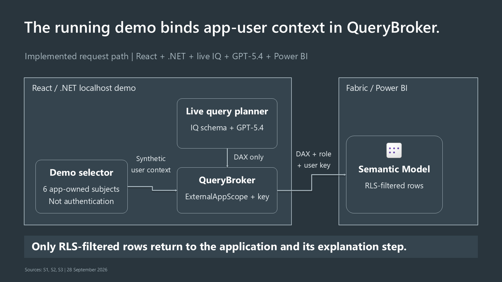

Fabric IQ application-identity RLS
==================================

An educational sample for ISVs adding AI analytics to an application whose users
are **not Microsoft Entra users**. Keep application identity in the backend;
let an LLM write a business query; let the semantic model enforce row access.

The working demo is a React portal and .NET 8 backend at
``http://127.0.0.1:5187``. Six synthetic subjects and five prepared **questions**
make the flow easy to inspect. Questions are not DAX templates.

::

    Application subject + question
      -> live Fabric IQ MCP schema
      -> GPT-5.4 generates DAX
      -> trusted broker adds fixed role + application subject
      -> executeDaxQueries -> semantic-model RLS -> Arrow/LZ4 rows
      -> separate GPT-5.4 call explains those authorized rows
      -> portal shows answer, exact rows and streamed technical trace

**The selector simulates authentication; it is not login.** Anyone using this
local demo can select any listed subject. Do not expose it beyond loopback.

Start here
----------

* `Five-minute learning guide and code tour <docs/learning-guide.rst>`_: understand
  the approach before setting up services.
* `Quickstart <docs/quickstart.rst>`_: run the local UI without cloud access, then
  connect a live deployment.
* `Deploy in your own development tenant <docs/deployment.rst>`_: model packaging,
  identities, permissions, configuration and cleanup.
* `Architecture <docs/architecture.rst>`_: actual calls, trust boundaries and
  parameter ownership.
* `Power BI Embedded comparison <docs/power-bi-embedded-comparison.rst>`_: what
  transfers, what differs, and what has not been demonstrated.
* `Observed status <docs/status.rst>`_: dated evidence, not fixture expectations.
* `Contributing <docs/contributing.rst>`_: keep this a small, useful community sample.
* `Implementation presentation v2 <docs/customer-overview_v2.rst>`_: actual
  components, observed demo behavior and editable diagrams.

What has worked
---------------

As of **28 September 2026**, selected live runs completed the integrated
IQ-schema -> generated-DAX -> RLS-query -> explanation chain:

* A1 overview: total 250, activity count 2; B1 overview: 700, count 1.
* No-access overview: 0, count 0.
* Paired-scope breakdown: A/Home 250, count 2; B/Auto 900, count 1.
* The paired subject asking for B/Home returned no authorized rows.

Underlying records and the explicit daily amount/count comparison also ran
successfully. The earlier deterministic harness passed **42 live adversarial engine-RLS
checks**. These are different kinds of evidence: successful RLS does not prove
that generated DAX answers every question correctly. The five-question,
six-subject matrix is not claimed complete. See `status <docs/status.rst>`_ for
the latest scope and remaining query-generation work.

This is a learning demo, not a production-ready application or a Microsoft
support statement. It has no application login, revocation workflow, hosted MCP
server, embedded report frame or demonstrated report/query parity.
**Foundry Agent Service is not required.** There are no fake answers, static
schema fallbacks or prepared-DAX fallbacks when a live service fails.

Run the local UI
----------------

Use Windows, PowerShell 7, Node.js 24+, the .NET 8/ASP.NET Core 8 runtime, and an
SDK compatible with `global.json <global.json>`_. The current SDK pin is
``9.0.318`` with latest-patch roll-forward; installing only an 8.x SDK does not
satisfy that pin. The application still targets ``net8.0``.

From the repository root::

    dotnet restore .\IqRls.sln --locked-mode
    npm --prefix .\src\DemoWeb ci
    pwsh -File .\tools\Start-Demo.ps1 -Build

Open ``http://127.0.0.1:5187``. Dependency restore downloads packages; starting
without live configuration only serves the local UI and catalog. Run remains
disabled and no cloud answers are substituted. The
`quickstart <docs/quickstart.rst>`_ separates this from a working live deployment.

Repository map
--------------

* `model <model/>`_: tiny inline Import model, exact customer/product-pair
  entitlements and synthetic expected results.
* `tools/model-definition <tools/model-definition/README.rst>`_: TOM validation
  and complete Fabric definition packaging; **not a deployment script**.
* `src/IqRls.Core <src/IqRls.Core/>`_: immutable context, certificate query broker
  and strict Arrow decoder.
* `src/IqRls.Demo <src/IqRls.Demo/>`_ and `src/DemoWeb <src/DemoWeb/>`_: live IQ
  planning, Responses clients, localhost API and technical inspector.
* `src/IqRls.Cli <src/IqRls.Cli/README.rst>`_ and `tests <tests/>`_: deterministic
  proof harness and offline checks.
* `Presentation assets <docs/customer-overview/>`_: versioned decks and diagrams.
  Check each version's evidence date; the original v1 overview predates the
  integrated live result. Deck rebuilding currently has author-local dependencies.

Sharing and license
-------------------

Authored sample code and documentation are licensed under `MIT <LICENSE>`_.
Microsoft artwork, product icons and trademarks are **not** relicensed by MIT;
see `THIRD_PARTY_NOTICES <THIRD_PARTY_NOTICES>`_ for their original terms.
This sample is not endorsed by Microsoft.

Keep real environment identifiers, credentials, certificates, auth caches and
raw live traces outside the repository. The repository remains private at this
snapshot; adding documentation and a license does not constitute public
publication.
