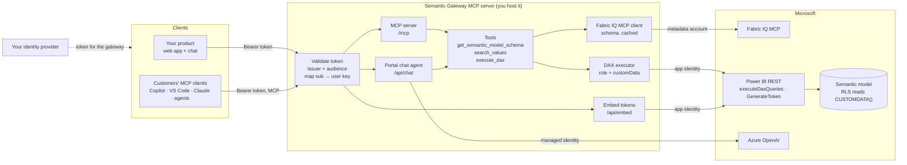
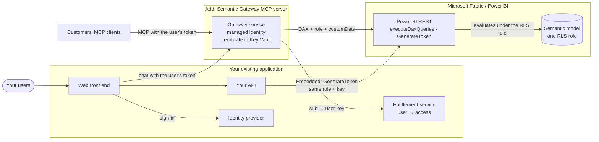
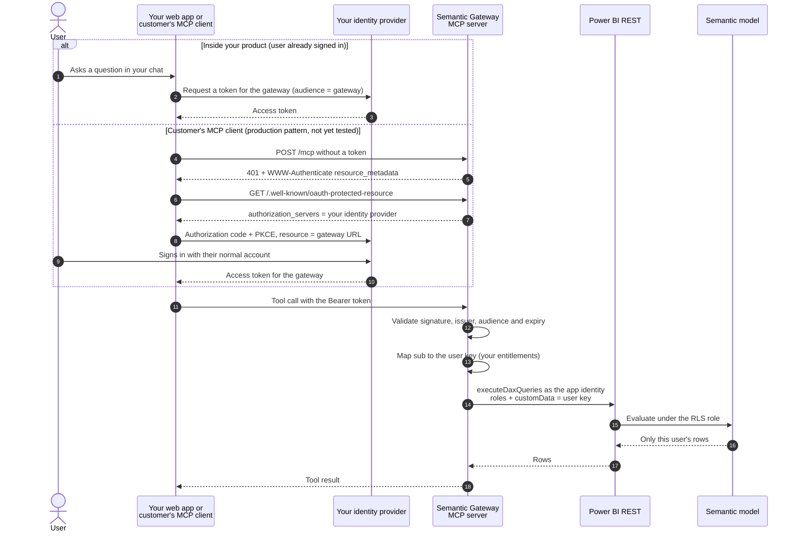

# The Semantic Gateway MCP server

The Semantic Gateway is a **custom MCP server that the ISV builds and hosts** in front of Microsoft Fabric.
Your product's chat and your customers' own MCP clients connect to it with your users' tokens. It reads
the model's schema from Fabric IQ, runs every query as your app identity with the user's key attached,
and the semantic model's row-level security decides which rows exist for that user.

It plays three roles:

| Role | Faces | What it does |
|---|---|---|
| **MCP server** | Your chat and customers' MCP clients (GitHub Copilot, VS Code, Claude, custom agents) | Serves `/mcp` with three read-only tools: `get_semantic_model_schema`, `search_values`, `execute_dax`. Built with the official [MCP C# SDK](https://github.com/modelcontextprotocol/csharp-sdk). |
| **MCP client** | Fabric IQ MCP | Reads `GetSemanticModelSchema` as a delegated metadata account, and caches it. Never runs queries through Fabric IQ. |
| **Enforcement point** | Power BI REST | Runs DAX through `executeDaxQueries` as the ISV's service principal, always with a fixed RLS role and `customData` = the user's key. |

The same service also hosts the portal chat agent (Azure OpenAI) and Power BI Embedded tokens, so both
paths share one identity and one RLS contract.

## Architecture

Where each piece lives in the code: [src/SemanticGateway/README.md](../src/SemanticGateway/README.md).

## Incorporating it into your application

Deploy the gateway **beside** your existing application. It reuses your sign-in and your entitlements;
it does not replace them.

| Step | What you do | Stand-in in this sample |
|---|---|---|
| 1. Register the gateway with your identity provider | Add it as an API with its own audience (for example `api://isv-semantic-gateway`), so your web app and MCP clients can request tokens for it. Set `Auth:Mode=Oidc`, `Auth:Authority`, `Auth:Audience`. | Built-in development issuer |
| 2. Connect user mapping to your entitlements | Replace `AppUserDirectory` with a lookup in your user or tenant store that turns the token's `sub` into the key your RLS table uses. | [samples/users.json](../samples/users.json) |
| 3. Add chat to your product | Your front end (or backend-for-frontend) calls `/api/chat` with the user's token, or your own agent calls the gateway's MCP tools. | [src/web](../src/web/) portal |
| 4. Open it to customers' MCP clients | Publish `https://<your-domain>/mcp`. Your identity provider must support the OAuth flow MCP clients use (see below). | GitHub Copilot CLI with a development token |
| 5. Keep Power BI Embedded as it is | Same service principal, same `CUSTOMDATA()` role, same key in `GenerateToken`. | `/api/embed` and the parity check |
| 6. Host it | Azure Container Apps or App Service over HTTPS; managed identity for Azure OpenAI; the service principal's certificate in Key Vault; the schema snapshot on durable storage. | `localhost:5187` |

**Separate service or module?** Run it as a **separate service** when you can. The service principal is a
workspace Admin, and keeping that credential out of your main API limits who can use it. It also scales
independently. For a small product, the gateway's `Fabric/` and `Tools/` folders and
`AddSemanticModelMcpServer()` can be copied into an existing ASP.NET Core backend instead.

## Auth flow for a user

What is particular about this flow:

1. **Tokens are for the gateway only.** It accepts only tokens whose issuer and audience it expects, and it
   never forwards them. Downstream it uses its own identities; there is no token passthrough.
2. **Users never hold a Microsoft token.** They need no Entra account. Power BI sees the ISV's service
   principal plus `customData`, not the end user.
3. **The key comes from the token, never from the request.** The gateway resolves `sub` to the user key on
   the server. Tool arguments cannot change the user, role or key; an injected `userKey` argument was
   ignored in the live test.
4. **Three service-side identities, each with one job:**

   | Identity | Used for | Note |
   |---|---|---|
   | Service principal (certificate) | `executeDaxQueries` and `GenerateToken` for every user | Workspace Admin, so the gateway must always send the role |
   | Metadata account (delegated) | Fabric IQ schema only | Signed in once; refresh token in the OS-protected cache |
   | Managed identity (Azure CLI locally) | Azure OpenAI for the portal agent | Not used by MCP clients, which bring their own model |

5. **Every request is checked.** The MCP endpoint is stateless, so each call carries and re-validates the
   token. Disable or unmap a user in your directory and the next call returns `403`; keep token
   lifetimes short.
6. **What MCP clients need from your identity provider:** authorization server metadata or OpenID Connect
   discovery, the authorization code flow with PKCE, a way to register the client (pre-registration,
   client ID metadata documents or dynamic client registration), and tokens issued for the gateway's
   audience. Support varies by client and provider, so check each combination. See
   [mcp-clients.md](mcp-clients.md).

**Tested on 29 September 2026:** the development issuer with bearer tokens, from the portal and from
GitHub Copilot CLI. **Not yet tested:** a real OIDC provider, and MCP clients running the interactive OAuth
flow.
