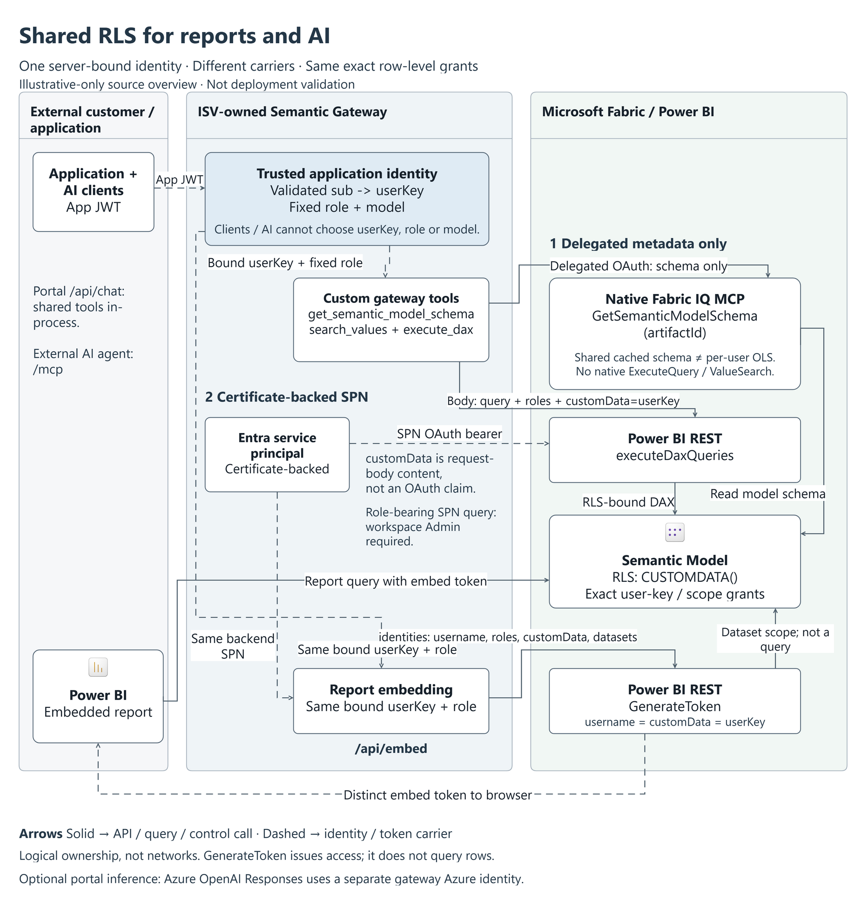

# Shared RLS architecture

**View:** high-level logical architecture of the implemented `CUSTOMDATA()` path.

**Source revision:** `84b9d80a92035ace1889be904d09e46ea9480111`.

**Documentation/API research and diagram review:** 2026-10-05.



## Files

| File | Purpose |
|---|---|
| [Full-size PNG](../images/shared-rls-architecture.png) | README/customer-readable overview. |
| [Native draw.io diagram](shared-rls-architecture.drawio) | Editable nodes, ownership containers, labels, and attached connectors; self-contained icons. |
| [Architecture definition](shared-rls-architecture.air.json) | Logical graph and source/assumption inventory. |
| [Astra rendered review](shared-rls-architecture.review.json) | Findings for the exact published diagram. |

Open the `.drawio` file in draw.io Desktop or a compatible editor. Labels and connectors are native
objects, not an architecture-sized bitmap. Icons retain their original artwork.

## Read the diagram

The boundaries represent **ownership**, not subnets or deployment topology. Solid arrows are
API/tool/query/control calls; dashed arrows represent identity or token carriers.

1. The application authenticates its user. The gateway validates the application JWT and resolves
   its `sub` to a server-owned user key. Clients and the AI cannot select that key, the role, or the model.
2. Custom `get_semantic_model_schema` uses a shared cache populated by native Fabric IQ MCP
   `GetSemanticModelSchema(artifactId)`, authenticated as a **delegated metadata account**.
   Native `ExecuteQuery` and `ValueSearch` are not called by this implementation.
3. Custom `search_values` and `execute_dax` use the **certificate-backed service principal** and Power BI
   REST `executeDaxQueries`. Its OAuth bearer authenticates the backend; `roles` and `customData = userKey`
   are separate request-body fields.
4. The same service principal creates the report's **distinct embed token** using `GenerateToken`.
   Its effective identity carries the same user key and role. Issuing that token is not a data query;
   the browser's report then queries the model under the scoped token.
5. The semantic model's configured role reads `CUSTOMDATA()` and enforces exact user-key/scope grants
   in both paths. Report filters and LLM instructions are not the authorization boundary.

The portal's `/api/chat` agent invokes the shared tools in-process; external agents use `/mcp`.
Optional Azure OpenAI inference uses a separate gateway Azure identity, not the Power BI service
principal's credential.

## Sources

| Contract | Current Microsoft documentation | Implemented source |
|---|---|---|
| Native IQ delegated authentication and schema tool | [Fabric IQ MCP](https://learn.microsoft.com/en-us/fabric/iq/connectors/fabric-iq-mcp) | [FabricIqSchemaClient.cs:31-65](https://github.com/bgbailey/fabric-iq-app-identity-rls/blob/84b9d80a92035ace1889be904d09e46ea9480111/src/SemanticGateway/Fabric/FabricIqSchemaClient.cs#L31-L65) |
| Service-principal query role and `customData` | [Execute Dax Queries In Group](https://learn.microsoft.com/en-us/rest/api/power-bi/datasets/execute-dax-queries-in-group) | [DaxQueryClient.cs:24-44](https://github.com/bgbailey/fabric-iq-app-identity-rls/blob/84b9d80a92035ace1889be904d09e46ea9480111/src/SemanticGateway/Fabric/DaxQueryClient.cs#L24-L44) |
| Certificate-backed app identity | [Service-principal embedding](https://learn.microsoft.com/en-us/power-bi/developer/embedded/embed-service-principal) | [PowerBiAppIdentity.cs:16-26](https://github.com/bgbailey/fabric-iq-app-identity-rls/blob/84b9d80a92035ace1889be904d09e46ea9480111/src/SemanticGateway/Fabric/PowerBiAppIdentity.cs#L16-L26) |
| Embed token and effective identity | [GenerateToken](https://learn.microsoft.com/en-us/rest/api/power-bi/embed-token/generate-token), [app-owns-data token flow](https://learn.microsoft.com/en-us/power-bi/developer/embedded/embed-tokens) | [EmbedTokenService.cs:25-47](https://github.com/bgbailey/fabric-iq-app-identity-rls/blob/84b9d80a92035ace1889be904d09e46ea9480111/src/SemanticGateway/Fabric/EmbedTokenService.cs#L25-L47) |
| Shared tools and configured role | [Embedded cloud RLS](https://learn.microsoft.com/en-us/power-bi/developer/embedded/cloud-rls) | [SemanticModelTools.cs:37-48](https://github.com/bgbailey/fabric-iq-app-identity-rls/blob/84b9d80a92035ace1889be904d09e46ea9480111/src/SemanticGateway/Tools/SemanticModelTools.cs#L37-L48), [ExternalAppScope.tmdl:7-27](https://github.com/bgbailey/fabric-iq-app-identity-rls/blob/84b9d80a92035ace1889be904d09e46ea9480111/model/Synthetic.SemanticModel/definition/roles/ExternalAppScope.tmdl#L7-L27) |

The API documentation above was retrieved on 2026-10-05. The diagram adds no capability based merely
on an icon or a generic architecture pattern.

## Review and editability

GPT-6 Astra authored the logical graph and reviewed the exact rendered diagram. The model-observation,
render-binding, and final gate checks passed. Native draw.io round-trip and actual mouse/keyboard
node moves, container moves, and label editing were exercised; connector attachment and child
preservation were observed, then edits were undone before publishing.

**Astra verdict: PASS, with one non-blocking low-severity label-crowding finding** around the
`GenerateToken` request and bound-identity connectors. The full finding is retained in the review file.
The published native diagram's SHA-256 is:

```text
9bfed438928ad0a317db2dad758704d41896b20b9d5e7f20c65477508885299e
```

Structural/visual review does not certify a deployment. The diagram's "illustrative-only source
overview" qualification refers to that distinction; the sample's separate
[live evidence](../evidence/live-validation-2026-10-05.md) records the synthetic report/AI rehearsal.

## Evidence gaps / still thin

- A deployment must qualify its identity mapping, certificate, tenant settings, workspace Admin access
  for role-bearing service-principal queries, model role, and grants.
- Shared filtered schema is not per-user OLS or a guarantee that all sensitive metadata references
  have been removed.
- Real OIDC/OAuth, profiles, SSO, customer-specific models, and hosted operations are outside this
  logical view and the synthetic rehearsal.
- Reference guidance was cached at `6c11ad58c25992e5d1435ce7cd80d217d5598a31`; its refresh was blocked
  by unrelated checkout changes. Current Learn contracts were checked; relevant Fabric blog retrieval
  returned HTTP 403.
- Product icon bytes have recorded matches to an official Microsoft distribution retrieved
  2026-09-16. That establishes the recorded asset, not that it is the newest available artwork.

Microsoft report and semantic-model artwork is used under the
[Fabric icon terms](https://learn.microsoft.com/en-us/fabric/fundamentals/icons), not relicensed under
MIT. Custom gateway, tool, API, and identity components use neutral boxes rather than invented
Microsoft product icons.
